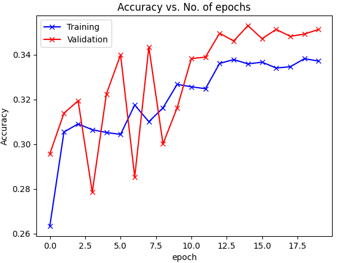

# Tree-Species-Classification

This project was done in the context of a course at Technical University of Munich for the course Data Science for Earth Observation.
It was a group project, but this repository contains mainly my contribution.

This repository contains a Jupyter notebook that implements ResNet18 for species classification using satellite imagery and GeoJSON data which was extracted via Google Earth Engine. The project focuses on processing multispectral data and training a deep learning model to classify different species of trees based on spectral bands.

## Project Overview

This project processes remote sensing data and applies machine learning techniques, particularly the ResNet18 convolutional neural network (CNN) architecture, to perform tree species classification. The data is derived from multispectral images, with bands such as B2, B3, B4, and others used to extract features for model training.

### Key Steps:
1. **Data Preprocessing**: The GeoJSON files are loaded and processed to extract relevant multispectral bands.
2. **Data Splitting**: The data is split into training and testing sets.
3. **Model Training**: ResNet18 is fine-tuned for tree species classification.
4. **Model Evaluation**: The trained model is evaluated using metrics such as accuracy and a confusion matrix.

## Installation

To run this project locally, follow these steps:

1. Clone this repository:
   ```bash
   git clone https://github.com/your-username/DSEO_Resnet18.git
   cd DSEO_Resnet18
   ```

2. Install the required dependencies using `pip`:
   ```bash
   pip install -r requirements.txt
   ```

   The dependencies include:
   - `torch`
   - `torchvision`
   - `pandas`
   - `numpy`
   - `scikit-learn`
   - `matplotlib`
   - `seaborn`
   - `PIL`

3. (Optional) Set up a virtual environment:
   ```bash
   python3 -m venv env
   source env/bin/activate
   ```

## Usage

1. Download and extract the dataset consisting of GeoJSON files with satellite image data.
2. Place the GeoJSON files in the appropriate directory, then change the path in the notebook.
3. Run the notebook step by step to preprocess the data, train the ResNet18 model, and evaluate the results.

You can use Google Colab or Jupyter Notebook locally to run the code.


## Model Details

ResNet18 is a convolutional neural network model commonly used for image classification tasks. It is chosen for its relatively small size and efficiency in image feature extraction, and we chose it in this case as the image resolution for each tree is very small being 5 x 5 px

- **Architecture**: ResNet18
- **Input**: Multispectral image bands (B2, B3, B4, etc.)
- **Output**: Species classification (e.g., Acer pseudoplatanus, Betula pendula)

## Results

The model achieved satisfactory classification accuracy based on the dataset provided. Below are some key evaluation metrics:
- **Training Accuracy**: 33.72%
- **Validation Accuracy**: 35.13%
- **Accuracy vs. No. of epochs**:
- 
<p align="center">
  
</p>
